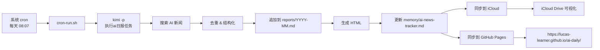

# AI日报（cron + kimi-code 版）

> 🌐 **公开日报站点**：https://lucas-learner.github.io/ai-daily/

本项目是一个自动化的 AI 行业日报工作流。每天由系统 cron 定时触发，调用 kimi-code 搜索当日 AI 新闻、去重整理、生成结构化日报，并同时发布到 iCloud（个人可视化同步）和 GitHub Pages（公开网页共享）。所有底层脚本、去重追踪器和站点源码均开源，方便他人复用或 fork 改造。

## 日报生成流程



## 目录

```
.
├── .kimi-code/skills/ai-daily/SKILL.md   # 日报执行 skill（唯一事实来源）
├── .venv/                                # Python 虚拟环境（markdown 渲染）
├── AGENTS.md                             # 项目级 Agent 指令
├── README.md                             # 本文件
├── docs/                                 # GitHub Pages 站点源文件
│   ├── index.html                        # 公开日报索引页
│   ├── daily-summary.html                # 最新日报摘要
│   └── reports/                          # 可视化日报 HTML
├── memory/
│   └── ai-news-tracker.md               # 去重追踪器
├── reports/
│   ├── YYYY-MM.md                       # 每月日报汇总
│   └── YYYY-MM.html                     # 可视化版本（由脚本生成）
├── logs/
│   └── ai-daily-YYYYMMDD.log            # 执行日志
└── scripts/
    ├── add-daily-entry.sh               # 将日报追加到月文件顶部
    ├── archive-month.sh                 # 月度总结 + HTML + iCloud 同步
    ├── cron-run.sh                      # 系统 cron 入口
    ├── generate-daily-summary.sh        # 生成每日摘要（支持 iCloud/GitHub 输出目录）
    ├── md-to-html.py                    # Markdown 转 HTML
    ├── sync-to-icloud.sh                # 同步到 iCloud
    ├── sync-to-github.sh                # 同步到 GitHub Pages
    ├── update-icloud-index.py           # 更新 iCloud 索引页
    └── update-github-pages.py           # 更新 GitHub Pages 索引页
```

## 定时任务

- 时间：每天 08:07（Asia/Shanghai）
- 主方式：系统级 `crontab`（生产兜底）
  - 入口脚本：`scripts/cron-run.sh`
  - 触发命令：`kimi -p "执行ai日报任务"`
  - 同步目标：iCloud + GitHub Pages（每日自动更新）
- 备用方式：kimi-code 内置 `CronCreate`（仅当前 session 生效，7 天后过期，仅用于临时调试）

## 同步目标

### iCloud 同步

每日 `.md`、渲染后的 `.html` 以及 `index.html` 索引页会同步到：

```
~/Library/Mobile Documents/com~apple~CloudDocs/数据同步/ai daily/
```

### GitHub Pages 同步

`docs/` 目录作为 GitHub Pages 发布源，由 `scripts/sync-to-github.sh` 自动推送到仓库。推送成功后，GitHub Pages 会在几分钟内重新部署公开站点。

## 依赖

```bash
python3 -m venv .venv
.venv/bin/pip install markdown
```

## 手动同步

如果某次 cron 的 GitHub Pages 同步失败，或需要立即发布最新日报，可手动执行：

```bash
# 同步指定月份到 GitHub Pages
bash scripts/sync-to-github.sh 2026-07

# 仅同步到 iCloud
bash scripts/sync-to-icloud.sh 2026-07
```

## Git

项目已初始化 git。修改后建议提交：

```bash
git add .
git commit -m "描述"
git push
```

## Skill 维护

项目级 skill 是单一事实来源：

```
/Users/macmini/projects/skills/ai-daily/.kimi-code/skills/ai-daily/SKILL.md
```

用户级 skill 是符号链接：

```
/Users/macmini/.kimi-code/skills/ai-daily/SKILL.md
```

修改项目级文件即可，无需手动同步。
